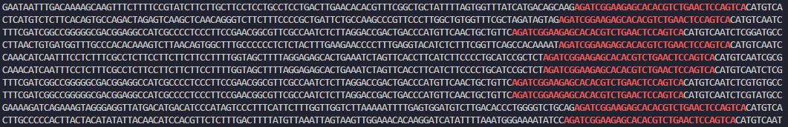
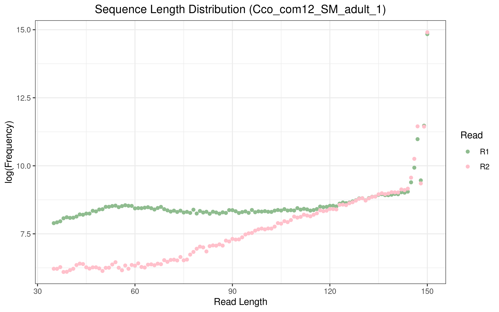
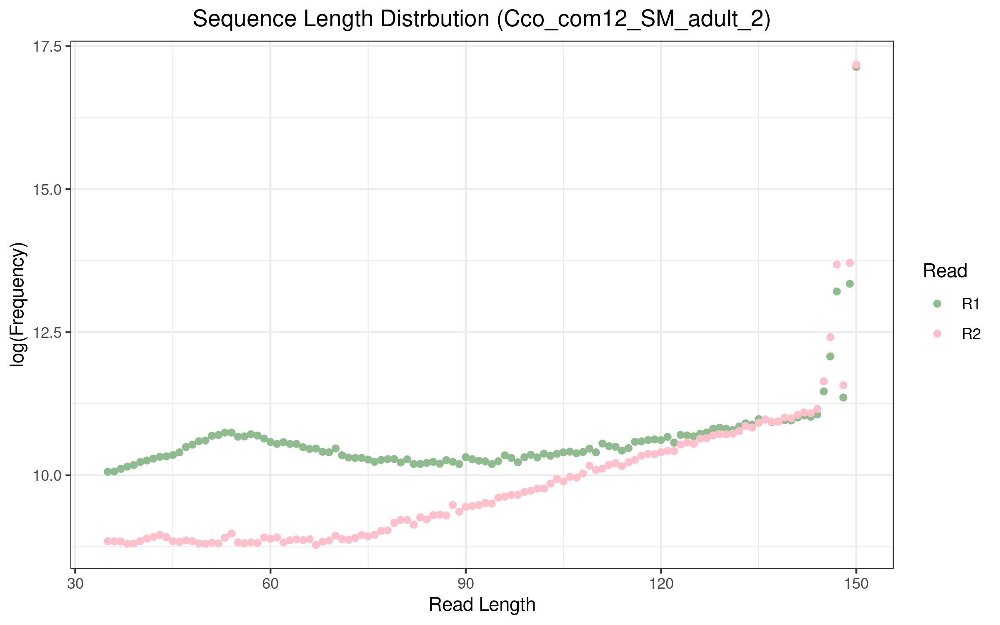

## Project 2 Part 2 answers
1. What proportion of reads (both R1 and R2) were trimmed?

Cco_com12_SM_adult_1:
- Read 1 had 8.2% of reads trimmed
- Read 2 had 9.4% of reads trimmed

Cco_com12_SM_adult_2:
- Read 1 had 6.6% of reads trimmed
- Read 2 had 7.8% of reads trimmed

---

2. Searched for adapter sequences:
```bash
$ zcat SRR25630373_1.fastq.gz | grep --color=always "AGATCGGAAGAGCACACGTCTGAACTCCAGTCA" | head

$ zcat SRR25630373_2.fastq.gz | grep --color=always "AGATCGGAAGAGCGTCGTGTAGGGAAAGAGTGT" | head

$ zcat SRR25630374_1.fastq.gz | grep --color=always "AGATCGGAAGAGCACACGTCTGAACTCCAGTCA" | head

$ zcat SRR25630374_2.fastq.gz | grep --color=always "AGATCGGAAGAGCGTCGTGTAGGGAAAGAGTGT" | head
```
I used `grep --color=always` to search for lines with the adaptor and identify them easily. Example output from the first command:

The correct adaptors appeared in the correct files (i.e., the forward read adaptor appeared in R1 files and the reverse read adaptor appeared in R2 files).

---

3. Comment on whether you expect R1s and R2s to be adapter-trimmed at different rates and why.

My plots from Part 2, Step 8:




It appears that for both adult 1 and adult 2, the read lengths begin to deviate at 120, with read 2 having a lower frequency of shorter read lengths. I would not expect R1 and R2 t be adapter-trimmed at different rates, and I suspect the difference could be due to adapter contamination.